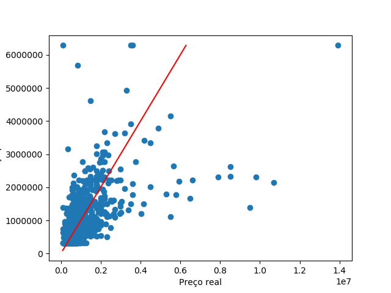

# MLP Multilayer Perceptron Estimar Preços de imóveis

## Introdução

Esse modelo de rede neural em regressão foi construído para prever o preço dos imóveis dada uma nova entrada, não foi realizado o tratamento nos dados esse e outro assunto, o intuito e a construção do modelo de regressão. Regressão, valor continuo. Falamos em regressão quando querendo prever algo a frente não classificar ou rotular, bom pagador mau pagador ou uma coisa, ou outra, exemplo, tipo valor de imóveis, quantidade de chuva, etc. Dentro do dado.csv ha X atributos de entrada e y atributo de saída mesmo para regressão temos que ter nosso y já que e um aprendizado supervisiona, temos que conhecer a saída dos nossos exemplos, então para cada conjunto de x1,x2...xn temos nosso y, então logo x1,x2,x3,x4,x5,y1

O arquivo "dados.csv" contem como atributos tando de entrada como de saída; property_type, state_name, surface_covered_in_m2, rooms, price.

property_type: primeiro atributo é o tipo da propriedade, há 4diferente tipos, que existe listarei esse são convertidos para que o algoritmo entender o relacionamento entra os atributos

state_name: nome do estado terá que fazer a discretização para achar a localidade de cada estado associado a seu número.

surface_covered_in_m2: superfície coberta em metros quadrados já esta no formato ideal para o algoritmo.

rooms: números de quarto.

price: também já esta no formato certo, esse e nosso atributo alvo que queremos prever, dado os atributos de entrada acima relaciona com a saída assim achando um padrão ou tendência para que o modelo aprenda.


## Code organization

- `MLP.p`: .........


## Train
you can now carry out "run" the python scrypt with the following command:

```sh
python3 MLP.p
```


<p align="center">
</img>
</p>
